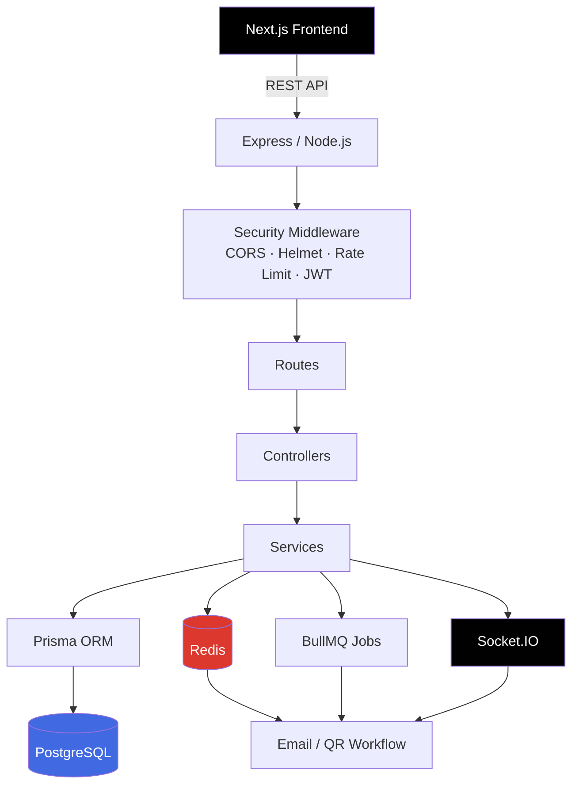
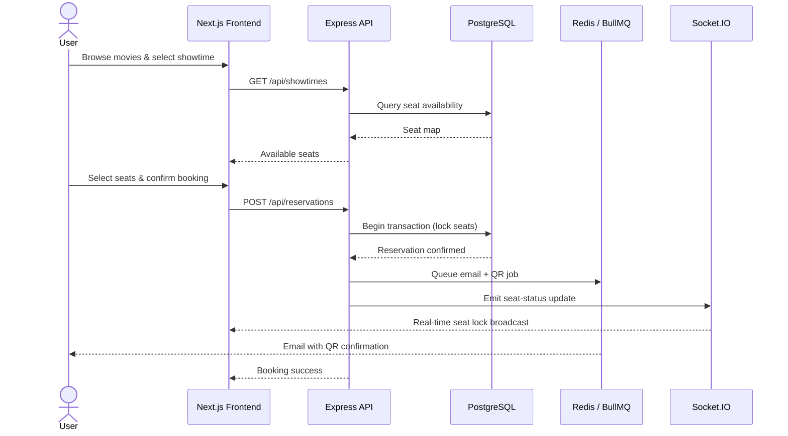
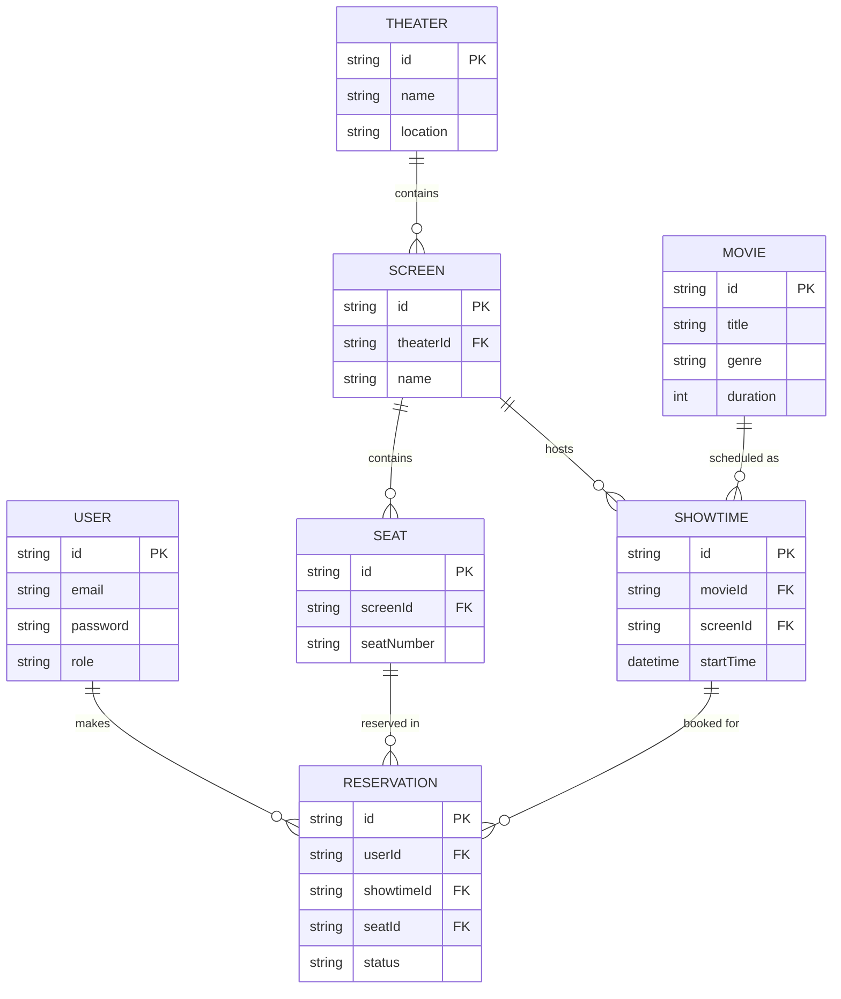

<div align="center">

# 🎬 Movie Reservation System

**A full-stack, production-oriented movie ticket booking platform**

Built with Next.js, Node.js, Express.js, TypeScript, PostgreSQL, Prisma ORM, JWT, Redis, BullMQ, and Socket.IO.

[](https://nextjs.org/)
[](https://nodejs.org/)
[](https://expressjs.com/)
[](https://www.typescriptlang.org/)
[](https://www.postgresql.org/)
[](https://www.prisma.io/)
[](https://redis.io/)
[](https://socket.io/)
[](https://render.com/)
[](#-license)

[Live Demo](#-live-application) · [Features](#-features) · [Architecture](#%EF%B8%8F-architecture) · [Setup](#%EF%B8%8F-local-setup) · [API Docs](#-api-documentation)

</div>

---

## 📑 Table of Contents

- [Live Application](#-live-application)
- [Features](#-features)
- [Tech Stack](#%EF%B8%8F-tech-stack)
- [Architecture](#%EF%B8%8F-architecture)
- [System Flow Diagram](#-system-flow-diagram)
- [Database Schema (ER Diagram)](#-database-schema-er-diagram)
- [Project Structure](#-project-structure)
- [Local Setup](#%EF%B8%8F-local-setup)
- [Environment Variables](#-environment-variables)
- [Booking Flow](#%EF%B8%8F-booking-flow)
- [Testing](#-testing)
- [API Documentation](#-api-documentation)
- [Production Security Verification](#%EF%B8%8F-production-security-verification)
- [Deployment](#-deployment)
- [Project Status](#-project-status)
- [Author](#-author)
- [Project Highlights](#-project-highlights)

---

## 🚀 Live Application

| Resource | Link |
|---|---|
| 🌐 Frontend | [movie-reservation-system-1-w2vm.onrender.com](https://movie-reservation-system-1-w2vm.onrender.com) |
| 🔧 Backend API | [movie-reservation-system-yq1d.onrender.com](https://movie-reservation-system-yq1d.onrender.com) |
| 📘 Swagger API Docs | [movie-reservation-system-yq1d.onrender.com/api-docs](https://movie-reservation-system-yq1d.onrender.com/api-docs) |

---

## ✨ Features

### 🔐 Authentication & Authorization
- User registration and login
- Password hashing with bcrypt
- JWT-based authentication
- Protected routes
- Role-based access control (`USER` / `ADMIN`)
- User profile and booking history

### 🎥 Movies
- Browse movies
- Movie details
- Search and genre filtering
- Date-based filtering
- Pagination
- Admin movie CRUD

### 🏢 Theater, Screen & Seat Management
- Theater management
- Screen management
- Automatic seat generation
- Seat availability by showtime
- Admin controls for theaters, screens, and seats

### 🎟️ Showtime & Reservations
- Date/time-based show scheduling
- Interactive seat selection
- Reservation creation
- Reservation cancellation
- Booking history
- Confirmed booking flow
- QR-based booking confirmation
- Transaction-based seat booking
- Database constraints to prevent double booking / overbooking

### ⚡ Real-Time & Background Processing
- Redis integration
- BullMQ background jobs
- Socket.IO real-time communication
- Email notification workflow
- Queue-based asynchronous processing

### 🛡️ Security
- Helmet security headers
- CORS allowlist for frontend origins
- API rate limiting
- JWT route protection
- bcrypt password hashing
- Environment-based configuration
- Express error handling
- Request validation with Zod

### 📊 Admin Dashboard
- Admin dashboard
- Movie management
- Theater management
- Screen and seat management
- Showtime management
- Revenue analytics

---

## 🛠️ Tech Stack

| Layer | Technology |
|---|---|
| Frontend | Next.js |
| Backend | Node.js, Express.js |
| Language | TypeScript |
| Database | PostgreSQL |
| ORM | Prisma |
| Authentication | JWT + bcrypt |
| Validation | Zod |
| Cache / Data Store | Redis |
| Background Jobs | BullMQ |
| Real-Time | Socket.IO |
| Email | Nodemailer |
| QR Code | QR generation library |
| API Documentation | Swagger / OpenAPI |
| Testing | Jest + Supertest |
| Deployment | Render |
| Version Control | Git + GitHub |

---

## 🏗️ Architecture



---

## 🔄 System Flow Diagram



---

## 🗄️ Database Schema (ER Diagram)



---

## 📂 Project Structure

```
Movie_Reservation/
│
├── client/                         # Next.js frontend
│   ├── app/                        # Pages / routes / UI
│   ├── components/                 # Reusable UI components
│   └── ...
│
├── server/                         # Express + TypeScript backend
│   ├── prisma/
│   │   ├── migrations/
│   │   └── schema.prisma
│   │
│   ├── src/
│   │   ├── controllers/
│   │   ├── services/
│   │   ├── routes/
│   │   ├── middlewares/
│   │   ├── validations/
│   │   ├── lib/
│   │   ├── config/
│   │   ├── workers/
│   │   ├── __tests__/
│   │   ├── app.ts
│   │   └── server.ts
│   │
│   ├── .env.example
│   ├── package.json
│   └── tsconfig.json
│
├── docs/
├── .gitignore
├── package.json
└── README.md
```

---

## ⚙️ Local Setup

### Prerequisites
- Node.js 18+
- PostgreSQL
- Redis
- npm

### 1. Clone the repository
```bash
git clone https://github.com/Riyaban583/Movie_Reservation_System.git
cd Movie_Reservation_System
```

### 2. Backend setup
```bash
cd server
npm install
```
Create `server/.env` using the required variables from `server/.env.example`.

### 3. Generate Prisma Client
```bash
npx prisma generate
```

### 4. Run migrations
```bash
npx prisma migrate dev
```

### 5. Start backend
```bash
npm run dev
```

### 6. Frontend setup
From the project root:
```bash
cd client
npm install
npm run dev
```

---

## 🔐 Environment Variables

> ⚠️ Do not commit real environment values. Use `.env.example` as the template.

Typical backend configuration includes:

```env
PORT=5000
DATABASE_URL="your_database_url"
JWT_SECRET="your_secret"
JWT_EXPIRES_IN="7d"
REDIS_URL="your_redis_url"
CLIENT_URL="http://localhost:3000"
PRODUCTION_CLIENT_URL="your_production_frontend_url"
PRODUCTION_API_URL="your_production_backend_url"
```

---

## 🎟️ Booking Flow

```mermaid
flowchart LR
    A[Select Movie] --> B[Select Date & Showtime]
    B --> C[Fetch Seat Availability]
    C --> D[Select Available Seats]
    D --> E[Reservation Request]
    E --> F[Database Transaction]
    F --> G[Unique Seat / Reservation Constraints]
    G --> H[Reservation Confirmed]
    H --> I[QR Confirmation + Notification]
    I --> J[Visible in My Bookings]
```



The reservation logic uses **database transactions and constraints** so concurrent requests cannot successfully reserve the same seat for the same showtime.

---

## 🧪 Testing

Run all backend tests:
```bash
cd server
npm test -- --runInBand
```

For open-handle diagnostics:
```bash
npm test -- --runInBand --detectOpenHandles
```

Current test suite includes movie and reservation tests, and the final test run completed with both suites passing.

---

## 📡 API Documentation

Swagger / OpenAPI documentation is available at:
👉 **https://movie-reservation-system-yq1d.onrender.com/api-docs**

Main API groups include:

| Endpoint | Description |
|---|---|
| `/api/auth` | Authentication & authorization |
| `/api/movies` | Movie browsing & admin CRUD |
| `/api/theaters` | Theater management |
| `/api/screens` | Screen management |
| `/api/showtimes` | Showtime scheduling |
| `/api/reservations` | Seat reservation & booking |
| `/api/dashboard` | Admin analytics dashboard |

---

## 🛡️ Production Security Verification

The deployed backend has been verified for:

- ✅ Helmet security headers
- ✅ Production CORS allowlist
- ✅ Rejection of unknown CORS origins
- ✅ Rate limiting (100 requests per 15 minutes)
- ✅ JWT authentication and role-based access
- ✅ Environment-based secrets

---

## 🚀 Deployment

The production frontend and backend are deployed on **Render**.

Production setup includes:
- Render PostgreSQL
- Render Redis
- Prisma migrations during deployment
- Production CORS configuration
- Environment variables managed through the hosting platform
- Swagger exposed through the deployed API

---

## 📌 Project Status

| Module | Status |
|---|---|
| Backend API | ✅ Complete |
| PostgreSQL + Prisma | ✅ Complete |
| JWT Authentication | ✅ Complete |
| RBAC | ✅ Complete |
| Movie Management | ✅ Complete |
| Theater / Screen / Seat Management | ✅ Complete |
| Showtime Scheduling | ✅ Complete |
| Reservation Engine | ✅ Complete |
| Anti-Overbooking | ✅ Complete |
| Redis | ✅ Complete |
| BullMQ | ✅ Complete |
| Socket.IO | ✅ Complete |
| Email / QR Workflow | ✅ Complete |
| Admin Dashboard / Analytics | ✅ Complete |
| Next.js Frontend | ✅ Complete |
| Swagger / OpenAPI | ✅ Complete |
| Automated Tests | ✅ Complete |
| Production Deployment | ✅ Complete |

---

## 👩‍💻 Author

**Riya Bansal**
GitHub: [@Riyaban583](https://github.com/Riyaban583)

---

## ⭐ Project Highlights

This project demonstrates:
- Modular MVC backend design
- Secure authentication and authorization
- Relational data modeling with Prisma and PostgreSQL
- Transaction-safe reservation handling
- Anti-overbooking design
- Caching and background processing
- Real-time communication
- API documentation and automated testing
- Production deployment and security hardening

---

<div align="center">

Made with ❤️ using Next.js, Node.js, and PostgreSQL

</div>
